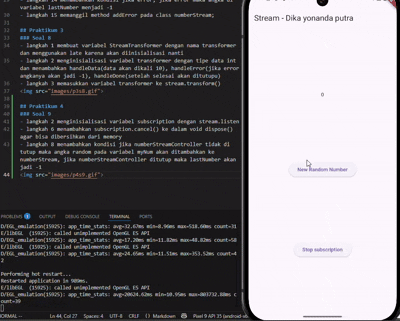

# stream_dika

## Praktikum 1
### Soal 1
tambah nama panggilan + ganti warna tema

### Soal 2
tambah 5 warna

### Soal 3
- yield* digunakan untuk meneruskan semua nilai dari stream yang dihasilkan oleh Stream.periodic()
- kode tersebut akan menghasilkan semua warna yang ada pada variabel colors tiap 1 detik

### Soal 4

### Soal 5
- await for akan akan melakukan looping dan menunggu sampai stream selesai sebelum lanjut ke kode berikutnya
- listen berjalan di background jadi tidak perlu menunggu selesai untuk menjalankan kode berikutnya

## Praktikum 2
### Soal 6
- langkah 8 menginisialisasi variabel numberStream, numberStreamController, stream, dan membuat stream.listen yang di dalamnya akan mengisi variabel lastNumber
- langkah 10 membuat method untuk membuat angka acak dari 0 - 9(totalnya 10 angka), dan menambahkannya ke variabel numberStream

### Soal 7
- pada langkah 13 membuat method addError yang akan menambahkan/mengirim error ke variabel controller
- langkah 14 menambahkan kondisi jika error, jika error maka angka di variabel lastNumber menjadi -1
- langkah 15 memanggil method addError pada class numberStream;

## Praktikum 3
### Soal 8
- langkah 1 membuat variabel StreamTransformer dengan nama transformer dan menggunakan late karena akan diinisialisasi nanti
- langkah 2 menginisialisasi variabel transformer dengan tipe data int dan menambahkan handleData(data akan dikali 10), handleError(jika error angkanya akan jadi -1), handleDone(setelah selesai akan ditutupu)
- langkah 3 memasukkan variabel transformer ke stream.transform()

## Praktikum 4
### Soal 9
- langkah 2 menginisialisasi variabel subscription dengan stream.listen
- langkah 6 menambahkan subscription.cancel() ke dalam void dispose() agar bisa dibersihkan dari memory
- langkah 8 menambahkan kondisi jika numberStreamController tidak di tutup maka angka random pada variabel myNum akan ditambahkan ke numberStream, jika numberStreamController ditutup maka lastNumber akan jadi -1

## Praktikum 5
### Soal 10
karena stream biasa hanya bisa didengar/listen sekali dalam satu waktu

### Soal 11
itu bisa terjadi karena kita mengubah stream biasa menjadi broadcast stream (bisa didengarkan oleh lebih dari satu listener secara bersamaan)
